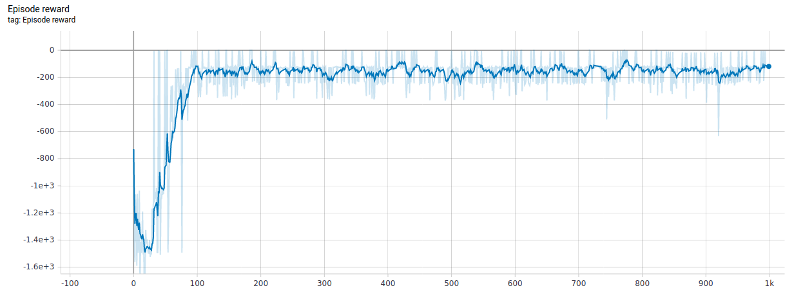

# Pendulum-problem
This is an [Inverted Pendulum](https://en.wikipedia.org/wiki/Inverted_pendulum)  problem from classic Control theory solved with [Deep Deteministic Policy Gradients](https://arxiv.org/pdf/1509.02971v2.pdf) model.

The model was trained on [OpenAI's Pendulum-v0](https://gym.openai.com/envs/Pendulum-v0/).



To change parameters of the model please use global variables of the train script. 

### Usage
*Note*: commands for Ubuntu 18.04
1. Clone the repository \
```git clone ```
2. Go to source root directory \
```cd pendulum_problem```
3. Run train script \
```python3 train_ddpg.py```

Folder `(old)pendulum_problem1.x` contain an outdated implementation for tensorflow 1.8.0

### Requirements:
*Note*: was tested on

* tensorflow == 2.0
* numpy == 1.18.1
* gym == 1.17.1